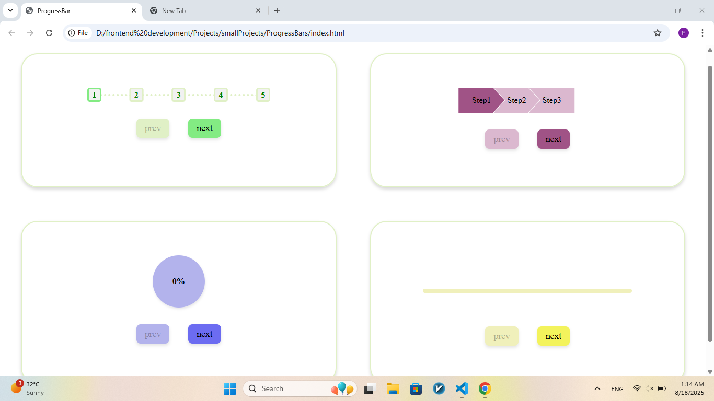

# Description

This project is a simple and interactive **Progress Steps Component** built with **Html, Css** and **javascript**.

### Live Demo  [Visit Here](https://ftm-khamse.github.io/ProgressSteps/)
## Features 
- responsive and minimal design
- Smooth transition and progress updates.
- Buttons automatically disabled at the first and last step
- Easy customizition with **CSS Variables**

---
